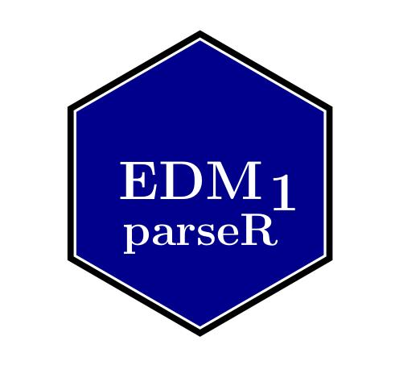

# Install

-> git clone https://github.com/julienlargetpiet/edm1.parseR

-> cd edm1.parseR

edm1.parseR > R

R > library("devtools")

R > build()

R > install()

# `read_edm_parser`

read_edm_parser


## Description

Allow to read data from edm parsed dataset, see examples


## Usage

```r
read_edm_parser(inpt, to_find_v = c())
```


## Arguments

Argument      |Description
------------- |----------------
`inpt`     |     is the input dataset
`to_find_v`     |     is the vector containing the path to find the data, see examples


## Examples

```r
print(read_edm_parser("(ok(ee:56))(ok(oui(rr((rr2:6)(rr:5))))(oui(bb(rr2:1)))(ee1:4))",
to_find_v = c("ok", "oui", "rr", "rr2")))

[1] "6"

print(read_edm_parser("(ok(ee:56))(ok(oui(rr((rr2:6)(rr:5))))(oui(bb(rr2:1)))(ee1:4))", to_find_v = c("ok", "ee")))

[1] "56"

print(read_edm_parser("(ok(ee:56))(ok(oui(rr((rr2:6)(rr:5))))(oui(bb(rr2:1)))(ee1:4))", to_find_v = c("ee")))

[1] "56"
```


# `write_edm_parser`

write_edm_parser


## Description

Allow to write data to edm parsed dataset, see examples


## Usage

```r
write_edm_parser(inpt, to_write_v, write_data)
```


## Arguments

Argument      |Description
------------- |----------------
`inpt`     |     is the input dataset
`to_write_v`     |     is the vector containing the path to write the data, see examples


## Examples

```r
print(write_edm_parser("(ok(ee:56))(ok(oui(rr((rr2:6)(rr:5))))(oui(bb(rr2:1)))(ee1:4))",
to_write_v = c("ok", "ee"), write_data = c("ii", "olm")))

[1] "(ok(ee:56)(ii:olm))(ok(oui(rr((rr2:6)(rr:5))))(oui(bb(rr2:1)))(ee1:4))"

print(write_edm_parser("(ok(ee:56))(ok(oui(rr((rr2:6)(rr:5))))(oui(bb(rr2:1)))(ee1:4))",
to_write_v = c("ok", "oui"), write_data = c("ii", "olm")))

[1] "(ok(ee:56))(ok(oui(rr((rr2:6)(rr:5))))(ii:olm)(oui(bb(rr2:1)))(ee1:4))"

print(write_edm_parser("(ok(ee:56))(ok(oui(rr((rr2:6)(rr:5))))(oui(bb(rr2:1)))(ee1:4))",
to_write_v = c("ok", "oui", "oui"), write_data = c("ii", "olm")))

[1] "(ok(ee:56))(ok(oui(rr((rr2:6)(rr:5))))(oui(bb(rr2:1)))(ii:olm)(ee1:4))"

print(write_edm_parser("",
to_write_v = c(), write_data = c("ii", "olm")))

[1] "(ii:olm)"
```


